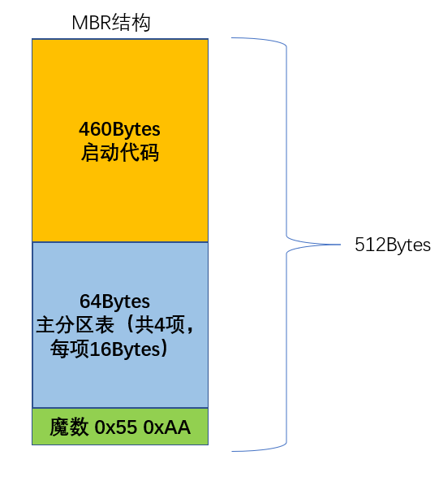
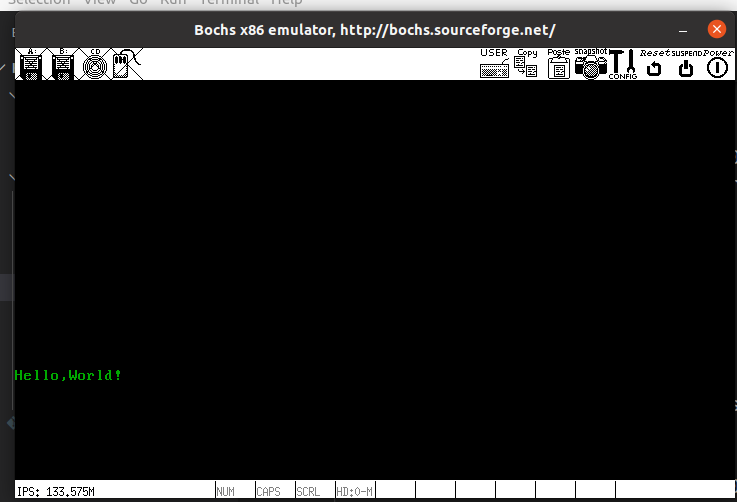

+++
author = "FanHe"
title = "第1课 初识MBR程序HelloWorld"
date = 2022-04-18T09:50:25+08:00
description = ""
categories = [
 "从零打造操作系统"
]
draft = false
+++

## 

## 1. 概述

从本文开始我们正式开始编码的工作，首先是所有学习语言的第一个程序”Hello,World"

## 2. MBR简介

主引导记录（**M**aster **B**oot **R**ecord）存放在磁盘的于0盘0道1扇区（扇区从1开始计数，这种标记磁盘的方式称为CHS(即柱面Cylinder磁头Header扇区Sector)表示法，另外还有一种称为LBA逻辑区块地址(Logical Block Address表示法)则是从0开始计数的）

计算机开机上电之后会进行开机自检，自检的过程实际上是运行BIOS里面程序（BIOS程序是写死在ROM之中的代码），BIOS运行的最后一步是读取磁盘中的MBR扇区内容，并将其拷贝到内存0x7C00的位置，以上过程都是固化写死的，不用我们关心

操作系统的启动类似于一场接力赛，BIOS选手把第一棒将给我们的MBR，从MBR开始之后就是我们需要关心的内容，于是我们需要首先编写MBR，MBR中的内容是固定的，如下图所示：



目前我们关心的只有第一项：启动代码，后续在进行磁盘管理方面功能开发的时候需要了解第二项

## 3. 编写程序

完整的代码如下

```asm6502
.code16

.section .text

movw %cs, %ax
movw %ax, %ds
movw %ax, %es
movw %ax, %fs
movw %ax, %gs
movw $0x7c00, %sp

/*
清屏利用0x06号功能,上卷全部行,则可清屏
中断号：INT x10　 功能号:0x06　　
功能描述:上卷窗口
输入: 
AH 功能号= 0x06
AL 上卷行数(如果为0，表示全部)
BH 上卷行属性
(CL,CH) = 窗口左上角的(X,Y)位置
(DL,DH) = 窗口右下角的(X,Y)位置
无返回值:
*/

movw $0x600, %ax
movw $0x700, %bx
movw $0x0, %cx
/*VGA文本模式中,一行只能容纳80个字符,共25行，
下标从0开始,所以0x18=24,0x4f=79,DX=0x184f
左上角(0,0)，右下角(80,25)
*/
movw $0x184f, %dx
int $0x10

//以下3行获取光标位置
movb $0x3, %ah
movb $0x0, %bh
int $0x10

//以下6行打印字符串
movw $message, %ax
movw %ax, %bp
movw $MSG_LEN, %cx
movw $0x1301, %ax
movw $0x2, %bx
int $0x10

jmp .

message:
    .ascii "Hello,World!"
MSG_LEN = . - message

.org 510
.word 0xaa55
```

代码基本上就是清屏和打印字符串的操作，需要注意的是：

（1）代码中使用的功能来自于BIOS自带的一些中断处理例程（类似于我们使用的一些库函数调用）

（2）我们生成的文件必须是纯二进制的文件，并且文件的大小固定是512个字节，这样才能满足MBR的要求

生成文件的可以使用as和ld两个工具编译和链接，使用ld需要编写ld的脚本，由于本系列使用的链接脚本内容不是关注的重点，在此一笔带过。链接是一个庞大的主题，如果深究下去也可以写一个系列，本系列关注操作系统的编写，链接使用的仅仅是最简单的脚本，如下

```
SECTIONS
{
    . = 0x7c00;
    .text : {*(.text)}
}
OUTPUT_FORMAT(binary)
```

脚本的作用是让连接器把文件中的符号起始地址设置在0x7c00处，这样我们在使用BIOS把我们的代码加载到0x7C00处运行时就不会出现错误

## 4. 编译并运行

编译我们使用了Makefile的脚本，随着工程的逐步壮大，有必要使用Makefile来组织整个项目，代码如下

```makefile
mbr.bin: mbr.o
    @ld -T mbr.lds -m elf_i386 mbr.o -o mbr.bin

mbr.o: mbr.s
    @as --32 mbr.s -o mbr.o

.PHONY:run,clean

run:
    make clean && make && make disk && bochs

disk:
    @bximage -mode="create" -hd=60M -imgmode="flat" -q hd60M.img
    @dd if=mbr.bin of=hd60M.img conv=notrunc

clean:
    @$(RM) -r *.txt *.o *.bin hd60M.img
```

运行效果如下：


